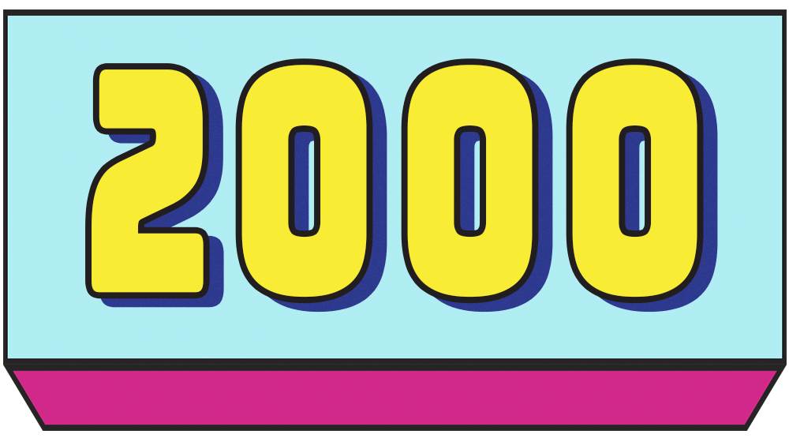
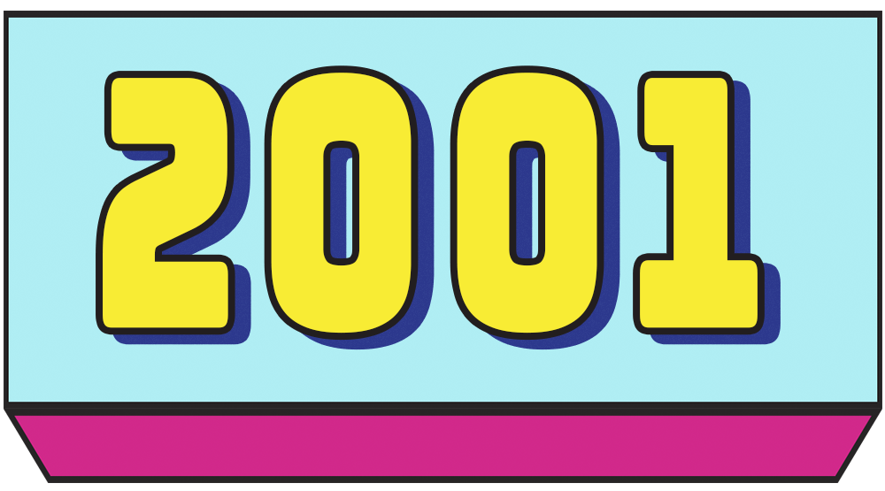
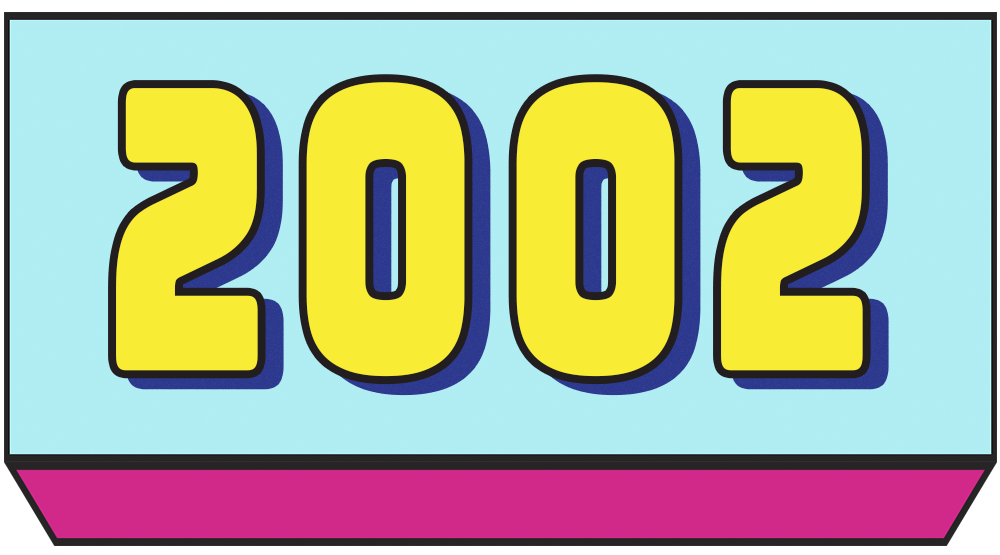

<html lang="id">

<head>
    <meta charset="UTF-8">
    <meta name="viewport" content="width=device-width, initial-scale=1.0">
    <meta http-equiv="X-UA-Compatible" content="ie=edge">
    <title>Karpalak - Sultra</title>
    
</head>

<body>

    <!-- Backsound yang otomatis terputar -->
    <audio id="backsound" autoplay loop>
        <source src="2.mp3" type="audio/mpeg">
        Your browser does not support the audio element.
    </audio>

    <!-- Header dengan background siluet -->
    <header>
        <h1>Karpalak - Sultra</h1>
    </header>

    <!-- Navigasi Interaktif -->
    <nav>
        <a href="#tentang-kami">Tentang Kami</a>
        <a href="#layanan">Layanan</a>
        <a href="#visi-misi">Visi & Misi</a>
        <a href="#portfolio">Portofolio</a>
        <a href="#struktur-organisasi">Struktur Organisasi</a>
        <a href="#kontak">Kontak Kami</a>
    </nav>

    <!-- Tentang Kami -->
    <section id="tentang-kami">
        <h2>Tentang Kami</h2>
        

            
Karpalak ?

        

    </section>

    <!-- Layanan Kami -->
    <section id="layanan">
        <h2>Layanan Kami</h2>
        

            
Karpalak ?

        

    </section>

    <!-- Visi dan Misi -->
    <section id="visi-misi">
        <h2>Visi & Misi</h2>
        

            
Visi Karpalak ?, sementara misi kami adalah Karpalak ?

        

    </section>

    <!-- Portofolio dengan gambar yang dapat diklik -->
    <section id="portfolio">
        <h2>Portofolio</h2>
        

            
            
            
        

    </section>

    <!-- Modal untuk menampilkan gambar portofolio -->
    

        

            &times;
            

        

    

    <!-- Struktur Organisasi -->
    <section id="struktur-organisasi">
        <h2>Struktur Organisasi</h2>
        

            

                
                <h3>Pendiri 1</h3>
                
Periode: 2018-2020

            

            

                
                <h3>Pendiri 2</h3>
                
Periode: 2019-2021

            

            

                
                <h3>Pendiri 3</h3>
                
Periode: 2020-2022

            

            

                
                <h3>Pendiri 4</h3>
                
Periode: 2021-2023

            

            

                
                <h3>Pendiri 5</h3>
                
Periode: 2020-2023

            

            

                
                <h3>Ketua Sekarang</h3>
                
Periode: 2023-Sekarang

            

        

    </section>

    <!-- Kontak Kami -->
    <section id="kontak">
        <h2>Kontak Kami</h2>
        

            
Hubungi kami melalui email di <a href="mailto:andiirfan1020@gmail.com">andiirfan1020@gmail.com</a> atau telepon: 085345674445

        

    </section>

    <!-- Footer -->
    <footer>
        
&copy; 2024 Andi Irfan Maulana. Semua Hak Dilindungi.

    </footer>

    
</body>

</html>
